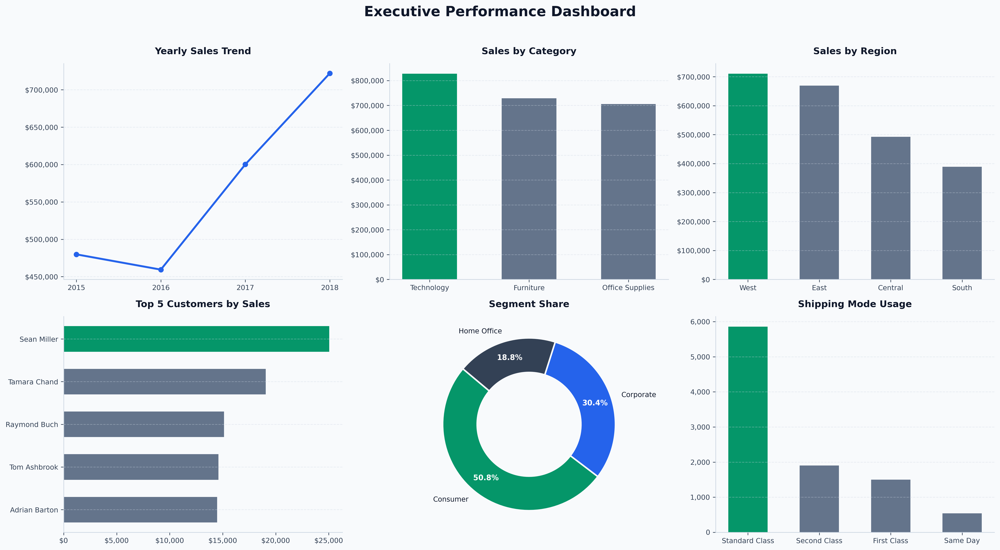

# 📊 Sales Performance Analysis

[](https://www.python.org/)
[](https://pandas.pydata.org/)
[](https://jupyter.org/)
[]()

An end-to-end sales performance analysis project built on historical order data (2015–2018). The project covers data cleaning, exploratory data analysis (EDA), and business insights across sales, customers, products, time trends, and shipping — wrapped up in a final dashboard and report.

---

## 📑 Table of Contents
- [📊 Sales Performance Analysis](#-sales-performance-analysis)
  - [📑 Table of Contents](#-table-of-contents)
  - [📌 Project Overview](#-project-overview)
  - [Business Problem](#business-problem)
  - [Objectives](#objectives)
  - [📁 Dataset Information](#-dataset-information)
  - [📂 Project Structure](#-project-structure)
  - [🛠️ Technologies Used](#️-technologies-used)
  - [🧹 Data Cleaning \& Preparation](#-data-cleaning--preparation)
  - [🔍 Exploratory Data Analysis (EDA)](#-exploratory-data-analysis-eda)
  - [❓ Key Business Questions Addressed](#-key-business-questions-addressed)
  - [📊 Dashboard \& Visualizations](#-dashboard--visualizations)
  - [🖼️ Dashboard Preview](#️-dashboard-preview)
  - [💡 Key Insights](#-key-insights)
  - [📈 Business Recommendations](#-business-recommendations)
  - [💻 How to Run the Project](#-how-to-run-the-project)
  - [🚀 Future Improvements](#-future-improvements)
  - [👤 Author](#-author)

---

## 📌 Project Overview

This project analyzes retail order data to understand overall business performance, sales trends, customer behavior, product performance, and shipping operations. The workflow goes from raw data understanding and cleaning, through category-specific analyses, and ends with a combined dashboard and a written report.

---

## Business Problem

The business wanted a clearer picture of where its sales were coming from and how well it was performing over time — which regions, products, and customers were driving revenue, whether sales showed seasonal patterns, and whether shipping/delivery performance was consistent across regions. This analysis was built to answer those questions using the available order data.

---

## Objectives

- Evaluate overall business performance (sales, orders, customers, products)
- Identify top-performing products and categories
- Identify high-value and repeat customers
- Understand geographic sales patterns
- Analyze sales trends and seasonality over time
- Evaluate shipping and delivery performance
- Turn findings into actionable business recommendations

---

## 📁 Dataset Information

- **Source Data:** `data/raw/orders.csv`
- **Cleaned Data:** `data/processed/cleaned_orders.csv`
- **Total Rows:** 9,800 orders
- **Total Columns:** 18
- **Time Period:** January 3, 2015 – December 30, 2018
- **Key Fields:** `Order Date`, `Ship Date`, `Sales`, `Category`, `Sub-Category`, `Region`, `Segment`, `Customer`, `Product`, `Ship Mode`, `Postal Code`

> **Note:** The raw dataset contained 9,800 rows total. Analysis metrics (e.g., 4,922 unique orders, 793 customers) reflect computed values from cleaned data. Please refer to individual notebooks for exact calculations.

---

## 📂 Project Structure

```text
sales-performance-analysis/
│
├── data/
│   ├── raw/
│   │   └── orders.csv
│   └── processed/
│       └── cleaned_orders.csv
│
├── notebooks/
│   ├── 01_data_understanding.ipynb
│   ├── 02_data_cleaning.ipynb
│   ├── 03_sales_performance_analysis.ipynb
│   ├── 04_customer_analysis.ipynb
│   ├── 05_product_analysis.ipynb
│   ├── 06_time_trend_analysis.ipynb
│   ├── 07_shipping_analysis.ipynb
│   └── 08_final_dashboard_analysis.ipynb
│
├── reports/
│   ├── charts/
│   ├── tables/
│   │   └── summary_metrics.csv
│   ├── sales-performance-analysis-report.md
│   └── sales-performance-analysis-report.pdf
│
└── README.md
```

---

## 🛠️ Technologies Used

- **Language:** Python
- **Data Manipulation:** Pandas, NumPy
- **Data Visualization:** Matplotlib, Seaborn
- **Environment:** Jupyter Notebook

---

## 🧹 Data Cleaning & Preparation

Key steps completed in `02_data_cleaning.ipynb`:

- Converted `Order Date` and `Ship Date` from string to `datetime` format.
- Converted `Postal Code` to a nullable integer type (`Int64`).
- Handled 11 missing values (0.11%) in `Postal Code` without dropping records.
- Verified zero duplicate rows.
- Standardized text and column names by removing trailing spaces.
- Validated `Sales` column to ensure no negative values exist.

---

## 🔍 Exploratory Data Analysis (EDA)

EDA was modularized across dedicated notebooks:

* **Business Performance:** Total revenue, order count, unique customers, and sales trajectories.
* **Customer Analysis:** Top customers, segment breakdown, repeat vs. one-time buyers, CLV indicators.
* **Product Analysis:** Top-selling products, category/sub-category breakdown, dead stock analysis.
* **Time Trend Analysis:** MoM/YoY growth, yearly seasonality, peak sales heatmaps.
* **Shipping Analysis:** Delivery lead times, shipping mode utilization, regional logistics gaps.

---

## ❓ Key Business Questions Addressed

1. What are the macro trends in sales, order volumes, and customer growth?
2. Which geographic regions and product categories drive the highest margin/revenue?
3. Who are the top 20% high-value customers driving the business?
4. Are sales impacted by strong Q4 seasonality?
5. Is the shipping pipeline efficient across all regions?

---

## 📊 Dashboard & Visualizations

Visual artifacts are saved under `reports/charts/` and summarized in `08_final_dashboard_analysis.ipynb`:

- Yearly & Monthly Sales Trends
- Revenue Distribution by Category, Region & State
- Top 10 Customers & Top 10 Products
- Seasonal Heatmaps (Month vs. Year)
- Delivery Time Distribution by Ship Mode

## 🖼️ Dashboard Preview



*Summary table exported to:* `reports/tables/summary_metrics.csv`

---

## 💡 Key Insights

- **Technology** was the top-performing category (~36.59% of total revenue), driven primarily by **Phones**.
- **West Region** generated the highest overall sales volume.
- Strong **Q4 Seasonality**: November and December consistently out-performed Q1 (January/February dip).
- High customer retention: Majority of revenue came from repeat buyers rather than single purchases.
- **Standard Class** was the default choice for shipping, though the **Central region** experienced slightly longer average delivery times.

---

## 📈 Business Recommendations

1. **Focus Inventory:** Prioritize stock allocation for Technology products in the West region.
2. **Smooth Seasonality:** Run targeted early Q1 promotions to reduce the post-holiday sales slump.
3. **Customer Retention:** Introduce a loyalty program for top-tier repeat customers.
4. **Catalog Pruning:** Re-evaluate or bundle products with single-order histories.
5. **Logistics Optimization:** Review fulfillment operations in the Central region to lower delivery lead times.

---

## 💻 How to Run the Project

1. **Clone the repository:**
   ```bash
   git clone https://github.com/SohailArif313/sales-performance-analysis.git
   cd sales-performance-analysis
   ```

2. **Install dependencies:**
   ```bash
   pip install pandas numpy matplotlib seaborn jupyter
   ```

3. **Run Notebooks:**
   Execute the notebooks sequentially inside the `notebooks/` directory (01 through 08).

---

## 🚀 Future Improvements

- Add Profit/Margin metrics for deeper profitability analysis.
- Build an interactive web dashboard using **Streamlit** or **Power BI**.
- Implement Time Series forecasting (e.g., ARIMA/Prophet) for future sales prediction.

---

## 👤 Author

* **Your Name** - [GitHub Profile](https://github.com/SohailArif313) | [LinkedIn](https://www.linkedin.com/in/muhammad-sohail-316279397/)